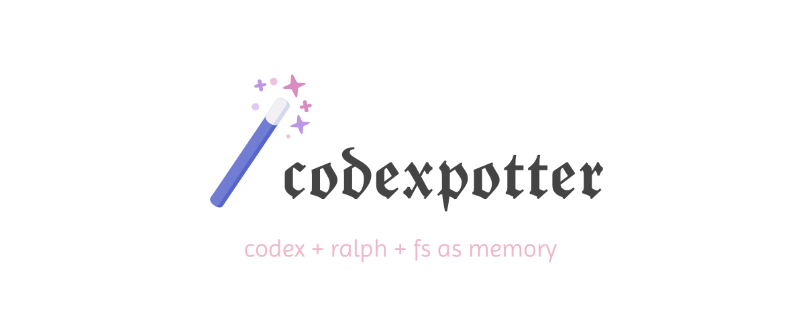
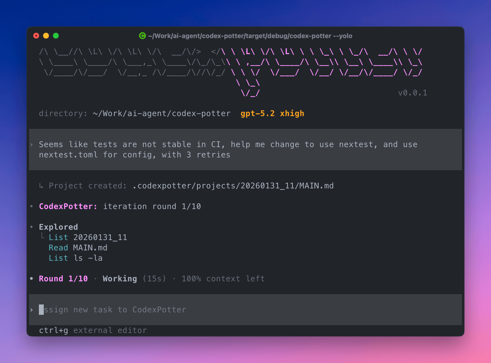

<!--

For agents: This file is carefully maintained and polished for better readability. Don't edit this file.

-->

<p align="center">
  
</p>

<p align="center">
  
</p>

&ensp;

## 💡 Why CodexPotter ($loop)

[](#)
[](https://www.npmjs.com/package/codex-potter)
[](https://github.com/breezewish/CodexPotter/actions/workflows/ci.yml)
[](./LICENSE)
[](https://linux.do)

**CodexPotter** continuously **reconciles** code base toward your instructed state ([Ralph Wiggum pattern](https://ghuntley.com/ralph/)):

- 🤖 **Codex-first** — Codex subscription is all you need; no extra LLM needed.
- 🧭 **Auto-review / reconcile** — Review and polish multi rounds until fully aligned with your instruction.
- 💦 **Clean-room** — Use clean context in each round, avoid context poisoning, maximize IQ.
- 🎯 **Attention is all you need** — Keep you focused on _crafting_ tasks, instead of _cleaning up_ unfinished work.
- 🚀 **Never worse than Codex** — Drive Codex, nothing more; no business prompts which may not suit you.
- 🧩 **Seamless integration** — AGENTS.md, skills & MCPs just work™ ; opt in to improve plan / review.
- 🧠 **File system as memory** — Store instructions in files to resist compaction and preserve all details.
- 🪶 **Tiny footprint** — Use [<1k tokens](./npm/resources/potter_worker.toml), ensuring LLM context fully serves your business logic.
- 📚 **Built-in knowledge base** — Keep a local KB as index so Codex learns project fast in clean contexts.

&ensp;

## 👀 How does it work

```plain

                                                𝒀𝑶𝑼𝑹 𝑷𝑹𝑶𝑴𝑷𝑻:
                                                𝘚𝘪𝘮𝘱𝘭𝘪𝘧𝘺 𝘵𝘩𝘦 𝘲𝘶𝘦𝘳𝘺 𝘦𝘯𝘨𝘪𝘯𝘦 𝘣𝘺 𝘧𝘰𝘭𝘭𝘰𝘸𝘪𝘯𝘨 ...
                                                                │
                                                                │
     codex: Work or review according to MAIN.md                 │
            ┌─────────────────────────┐                         │
            │                         │                         ▼
  ┌─────────┴─────────┐     ┌─────────▼────────┐       ┌───────────────────┐
  │    main agent     │     │     subagent     │◄─────►│      MAIN.md      │
  └─────────▲─────────┘     └─────────┬────────┘       └───────────────────┘
            │                         │
            │      Work finished      │
            └─────────────────────────┘

```

&ensp;

## ⚡️ Getting started

1. Use the all-in-one wizard, it helps you set up gitignore, subagent definitions and skills _globally_:

```bash
npx codex-potter@next setup
```

2. Use `$loop` to trigger the CodexPotter workflow in Codex CLI or Codex Desktop:

```plain
$loop Implement /ps endpoint according to docs/ps_design.md
```

&ensp;

## Tips

### Prompt Examples

**✅ tasks with clear goals or scopes:**

- $loop port upstream codex's /resume into this project, keep code aligned

**✅ persist results to review in later rounds:**

- $loop create a design doc for ... **in DESIGN.md**

**❌ interactive tasks with human feedback loops:**

CodexPotter is not suitable for such tasks, use codex instead:

- Front-end development with human UI feedback
- Question-answering
- Brainstorming sessions

### Howto

<details>
<summary>Plan and execute</summary>

Simpliy queue two tasks via $loop, one is plan, one is implement, for example:

Task prompt 1:

```plain
$loop Analyze the codebase, research and design a solution for introducing subscription system.
Output plan to docs/subscription_design.md.

Your solution should meet the following requirements: ...

Do not implement the plan, just design a good and simple solution.
```

↑ Your existing facility to write good plans will be utilized, including skills, plan doc principles
in AGENTS.md, etc. **Writing plan to a file is CRITICAL** so that the plan can be iterated multiple rounds and task 2 can pick it up.

Task prompt 2:

```plain
$loop Implement according to docs/subscription_design.md

Make sure all user journeys are properly covered by e2e tests and pass.
```

</details>

&ensp;

## Roadmap

- [x] Resume
- [ ] Handling steer
- [ ] Better handling of stream disconnect / similar network issues
- [ ] Agent-call friendly (non-interactive exec and resume)
- [x] Interoperability with codex CLI sessions (for follow-up prompts)
- [ ] Better plan / user selection support
- [x] Better sandbox support

&ensp;

## License

- Apache-2.0 License
